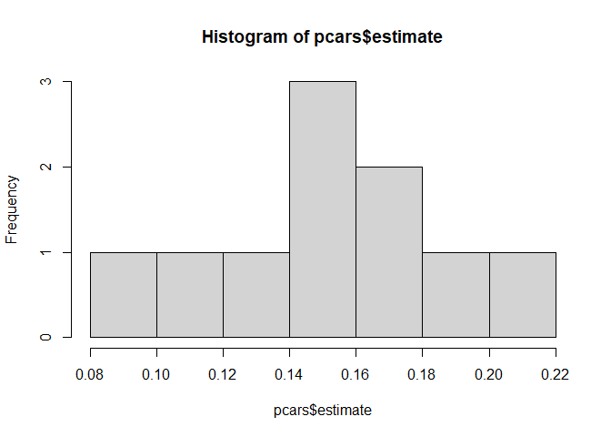

<!-- README.md is generated from README.Rmd. Please edit that file -->

# puncture

<!-- badges: start -->
<!-- badges: end -->

The goal of puncture is to implement a bootstrap-based analysis method.
The method implements the following algorithm for each bootstrap
iteration:

- Generate a missingness pattern using the specified
- Apply the pattern to create a dataset with missing values
- Perform multiple imputation
- Fit the specified model to each imputed dataset
- Pool results across imputations using Rubin’s rules
- Extract the requested statistics for the term of interest

## Installation

You can install the development version of puncture from
[GitHub](https://github.com/) with:

``` r
# install.packages("pak")
pak::pak("mightymetrika/puncture")
```

## Puncturing ‘cars’

This is how pucnture() works with the ‘cars’ dataset.

``` r
library(puncture)

set.seed(1913)
summary(stats::lm(speed ~ dist, cars))
#> 
#> Call:
#> stats::lm(formula = speed ~ dist, data = cars)
#> 
#> Residuals:
#>     Min      1Q  Median      3Q     Max 
#> -7.5293 -2.1550  0.3615  2.4377  6.4179 
#> 
#> Coefficients:
#>             Estimate Std. Error t value Pr(>|t|)    
#> (Intercept)  8.28391    0.87438   9.474 1.44e-12 ***
#> dist         0.16557    0.01749   9.464 1.49e-12 ***
#> ---
#> Signif. codes:  0 '***' 0.001 '**' 0.01 '*' 0.05 '.' 0.1 ' ' 1
#> 
#> Residual standard error: 3.156 on 48 degrees of freedom
#> Multiple R-squared:  0.6511, Adjusted R-squared:  0.6438 
#> F-statistic: 89.57 on 1 and 48 DF,  p-value: 1.49e-12
pcars <- puncture(cars,
                  b = 10,
                  m = 5,
                  mpat = function(mdat){ # define missing data pattern
                    n <- nrow(mdat) * ncol(mdat)
                    c1 <- stats::rbinom(n, 1, 0.8)
                    c2 <- stats::rbinom(n, 1, 0.8)
                    pattern_vec <- c1 * c2
                    matrix(pattern_vec, nrow = nrow(mdat), ncol = ncol(mdat))
                    },
                  form = "speed ~ dist",
                  term = "dist",
                  func = stats::lm,
                  statistics = c("estimate","p.value"),
                  remove.collinear=FALSE # passed to mice::mice(...)
                  )
hist(pcars$estimate)
```



``` r
mean(pcars$estimate)
#> [1] 0.1536592
median(pcars$p.value)
#> [1] 1.74164e-07
```
